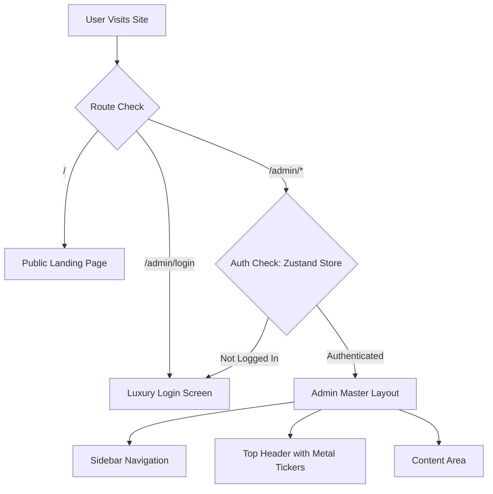
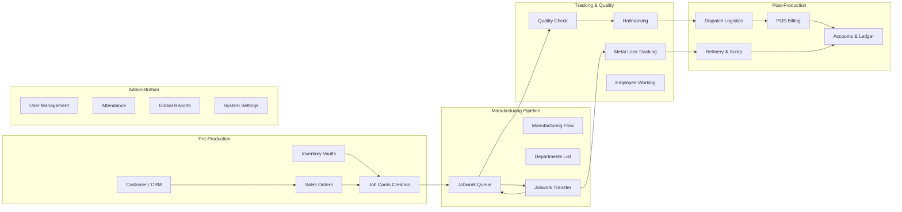
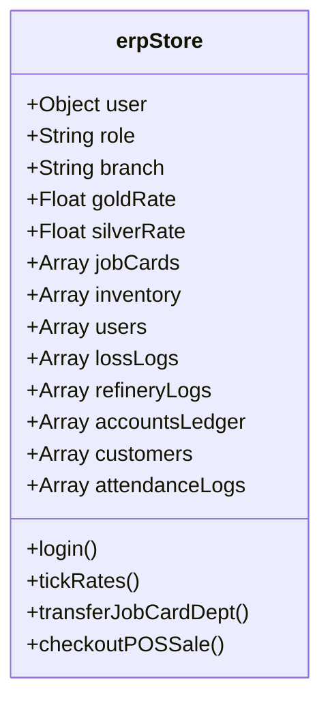

# HG Enterprises ERP - System Architecture & Flow

This document outlines the entire structure, module routing, and data flow of the HG Enterprises Jewellery ERP system. 

## High-Level Application Flow

The system uses a master routing mechanism in `App.jsx` that funnels users through a secure authentication layer before granting access to the premium modular dashboard.

## Module Architecture (Admin Panel)

The system contains 20 interconnected modules that track a piece of jewellery from raw material all the way to customer delivery. 

## Global State Data Models (Zustand `erpStore.js`)

The entire application relies on a centralized Zustand store that simulates a real-time database.

## Module Deep-Dive Details

1. **Dashboard (`/admin`)**: Real-time overview of active job cards, total inventory value, recent metal losses, and live market rates.
2. **Manufacturing (`/admin/manufacturing`)**: High-level flow visualization of the 25-stage manufacturing process.
3. **Departments (`/admin/departments`)**: Configuration of the 25 departments (e.g., Casting, Filing, Polish), including auto-loss percentages and capacity.
4. **Job Cards (`/admin/jobcards`)**: Creation of manufacturing tickets containing SKUs, diamonds/stones, gross weights, and timelines.
5. **Jobwork Queue (`/admin/queue`)**: The active workbench showing items waiting in the current department.
6. **Jobwork Transfer (`/admin/transfer`)**: Form to move a job from one department to the next, logging exact metal scrap and dust losses along the way.
7. **Worklog (`/admin/worklog`)**: Tracks which craftsman worked on which job during which shift.
8. **Loss Tracking (`/admin/losstracking`)**: Aggregates all microscopic metal dust and scrap losses from the manufacturing process.
9. **Inventory (`/admin/inventory`)**: Vault tracker for Gold, Silver, Diamonds, and Finished Goods with real-time valuation and availability statuses.
10. **Orders (`/admin/orders`)**: Pipeline for B2B wholesale and custom B2C retail orders.
11. **POS Billing (`/admin/billing`)**: Retail checkout interface handling cash, split payments, and old gold exchange scrap calculations.
12. **CRM (`/admin/crm`)**: Customer profiles, loyalty points, and Suvarna Gold Scheme installment tracking.
13. **Refinery (`/admin/refinery`)**: Module to process collected scrap and floor dust and convert it back into pure fine metal credits.
14. **QC Checklist (`/admin/qc`)**: Pass/Fail approval queue for finished items before hallmarking.
15. **Hallmark (`/admin/hallmark`)**: BIS/HUID stamping registration.
16. **Dispatch (`/admin/dispatch`)**: Secure shipping, tracking label generation, and logistics handoff.
17. **Accounts (`/admin/accounts`)**: Global double-entry ledger tracking POS inflows, refinery credits, and expenses.
18. **Reports (`/admin/reports`)**: Data visualization and analytics dashboards.
19. **Administration (`/admin/users`)**: Staff directories and role permissions.
20. **Attendance (`/admin/attendance`)**: Employee Punch-In/Out kiosk and shift tracking history.

## Development & Maintenance Plan

If you wish to scale this application further, here is the recommended plan:

1. **Phase 1: Backend Integration**
   - The current `erpStore.js` is incredibly robust but runs entirely in browser memory. 
   - *Next Step*: Replace the synchronous Zustand actions with asynchronous `fetch`/`axios` calls to a Node.js/Express backend, syncing with a PostgreSQL or MongoDB database.
2. **Phase 2: Authentication**
   - The current login uses a simulated role-check.
   - *Next Step*: Implement JWT (JSON Web Tokens) or NextAuth for secure, session-based routing.
3. **Phase 3: Hardware Integration**
   - The app currently features mock barcode/RFID scanning inputs.
   - *Next Step*: Bind physical USB barcode scanners and weighing scale serial ports to the frontend input fields using the Web Serial API.
